<div align="center">

# 🛍️ ShopSphere

### A Modern Full-Stack MERN E-Commerce Platform

A feature-rich, production-ready e-commerce application built using the **MERN Stack** with secure authentication, responsive UI, payment integration, wishlist, coupons, invoice generation, admin APIs, and a seamless shopping experience.

<p>


</p>

### 🌐 Live Demo

**Frontend:** https://shopsphere-nu-one.vercel.app

**Backend API:** https://shopsphere-g67n.onrender.com/api

</div>

---

# 📖 About

ShopSphere is a full-stack e-commerce platform designed to simulate a modern online shopping experience similar to Amazon and Flipkart.

The application provides secure user authentication, product browsing, advanced filtering, shopping cart management, wishlist, checkout, Razorpay payment integration, invoice generation, order management, responsive design, and a clean user interface built with React.

--- 

# 🚀 Highlights

- 🔐 JWT Authentication & Authorization
- 🛒 Shopping Cart & Wishlist
- 💳 Razorpay Payment Integration
- 🎟️ Coupon System
- 📄 PDF Invoice Generation
- 🌙 Dark / Light Theme
- 📱 Fully Responsive Design
- 🔎 Product Search & Filters
- ❤️ Wishlist Management
- 📦 Order Tracking & Cancellation
- ☁️ Cloudinary Image Upload
- 🛡️ Helmet, Rate Limiting & Security Middleware

---

# ✨ Features

## 👤 Authentication

- JWT Authentication
- Secure Login & Registration
- Password Encryption (bcrypt)
- Protected Routes
- User Profile Management

---

## 🛍️ Shopping Experience

- Beautiful Landing Page
- Product Catalog
- Product Search
- Category Browsing
- Advanced Filters
- Product Details
- Wishlist
- Shopping Cart
- Quantity Management
- Responsive Design
- Dark Mode

---

## 💳 Checkout & Orders

- Address Management
- Coupon System
- Razorpay Payment Gateway
- Cash on Delivery
- Order Summary
- Order History
- Order Cancellation
- PDF Invoice Download

---

## ⚙️ Backend Features

- REST API
- MongoDB Atlas
- Express.js
- JWT Authentication
- Cloudinary Image Upload
- Swagger API Documentation
- Rate Limiting
- Helmet Security
- Mongo Sanitize
- XSS Protection
- HPP Protection
- Compression

---

# 🛠 Tech Stack

## Frontend

- React
- Vite
- React Router
- Axios
- Tailwind CSS
- Lucide Icons
- Context API

## Backend

- Node.js
- Express.js
- MongoDB Atlas
- Mongoose
- JWT
- bcrypt
- Cloudinary
- Razorpay
- Swagger

## Deployment

- Vercel (Frontend)
- Render (Backend)
- MongoDB Atlas

---

# 📸 Screenshots

## 🏠 Home Page


---

## 🛒 Products

### Product Listing

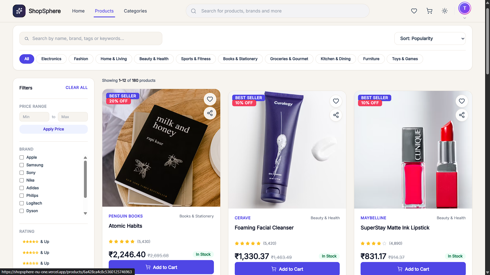

### Filters & Product Grid

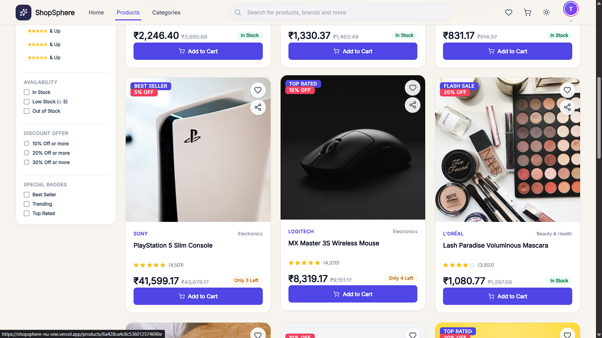

---

## 📦 Product Details

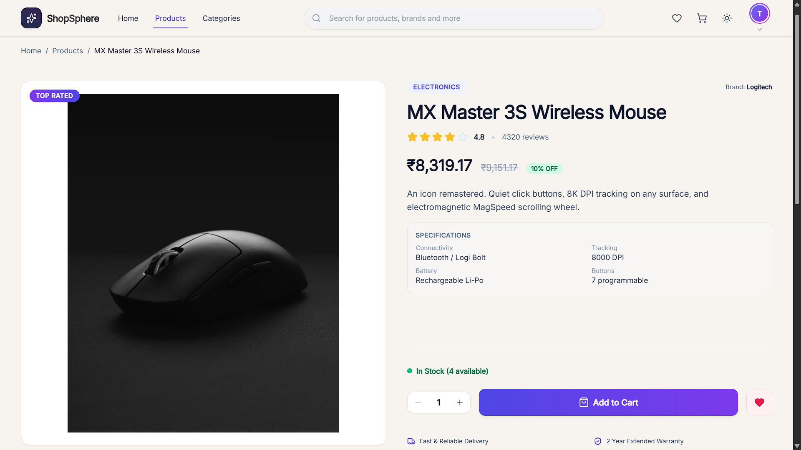

---

## 🛍️ Shopping Cart

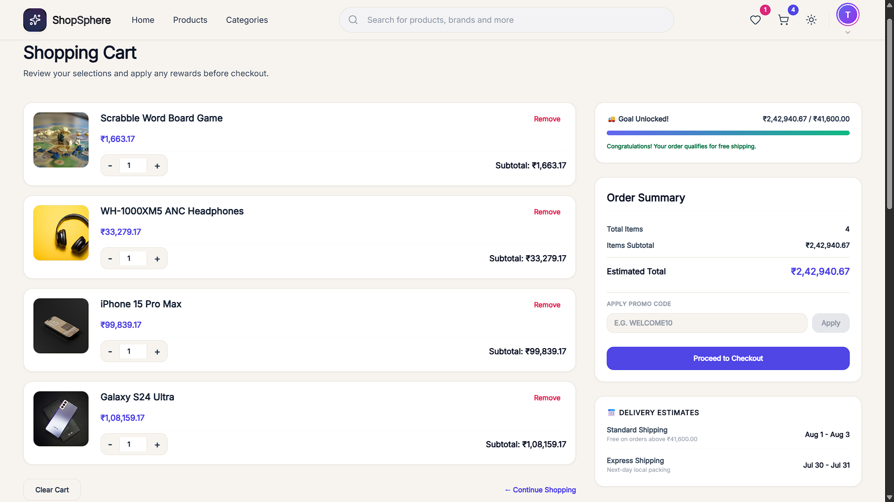

---

## 💳 Checkout

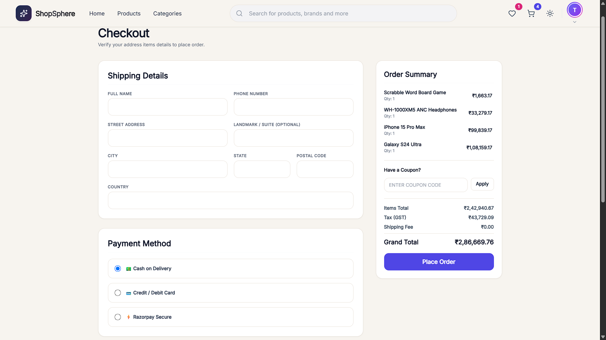

---

## 📦 Orders

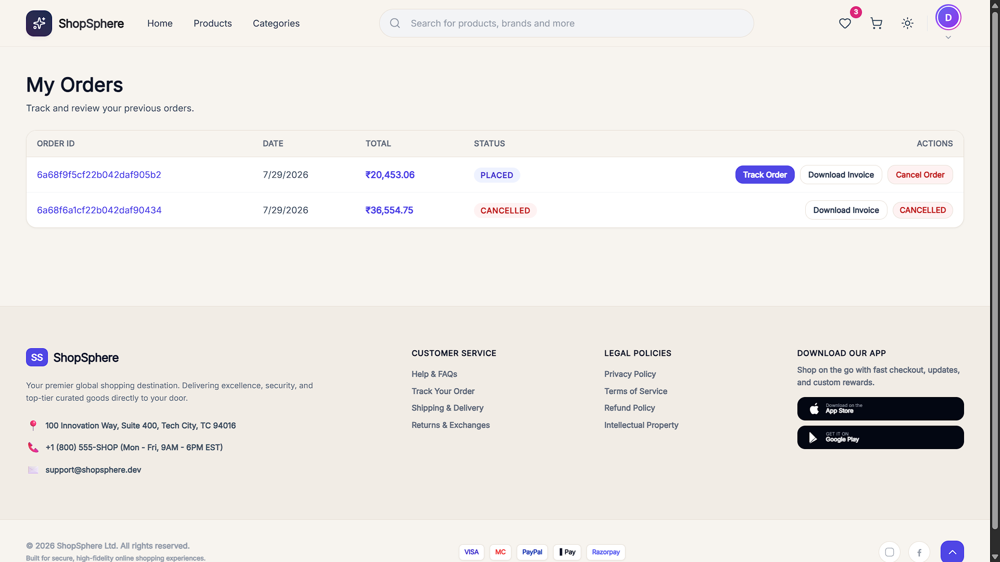

---

## ❤️ Wishlist

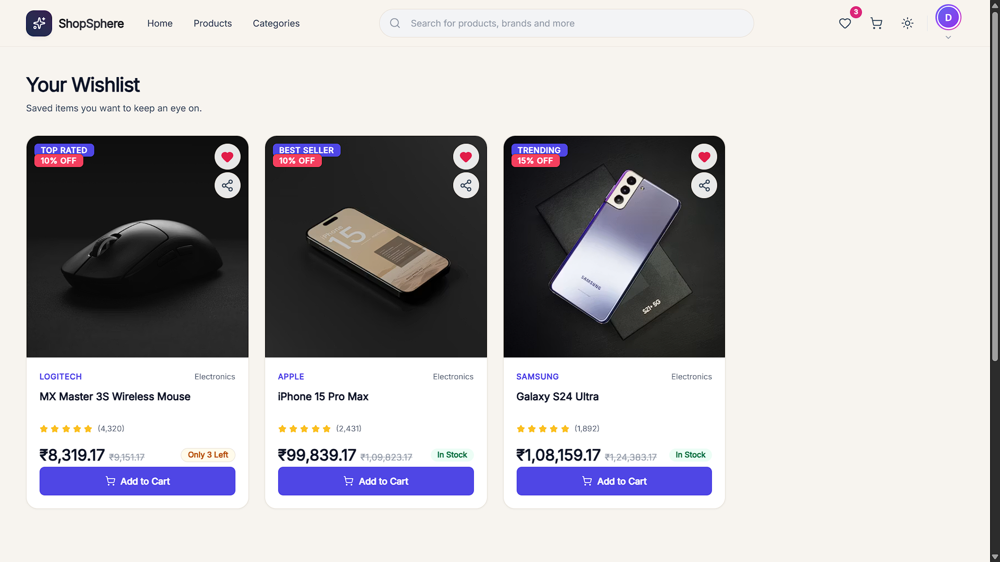

---

## 🧾 Invoice Management

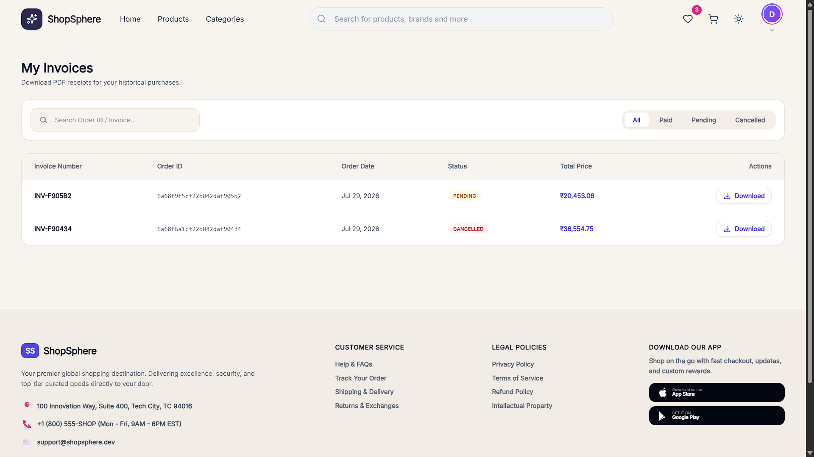

---

## 👤 User Profile

### Account Dashboard

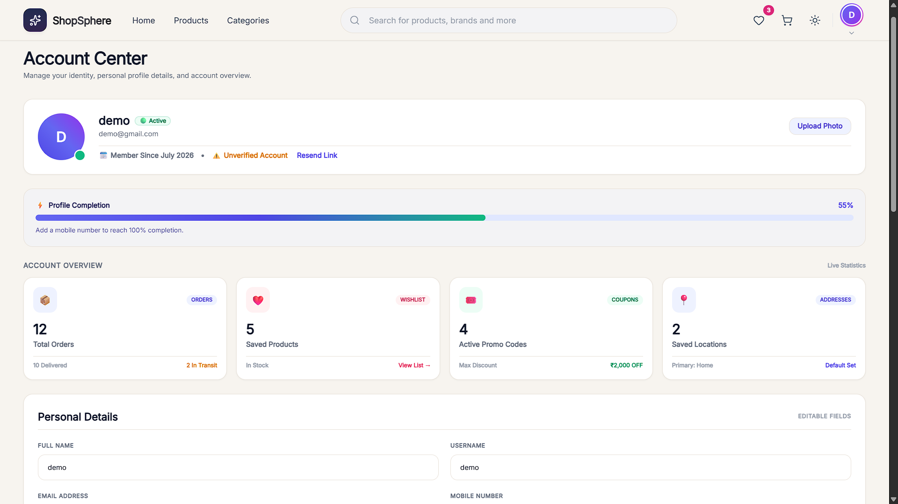

### Personal Details

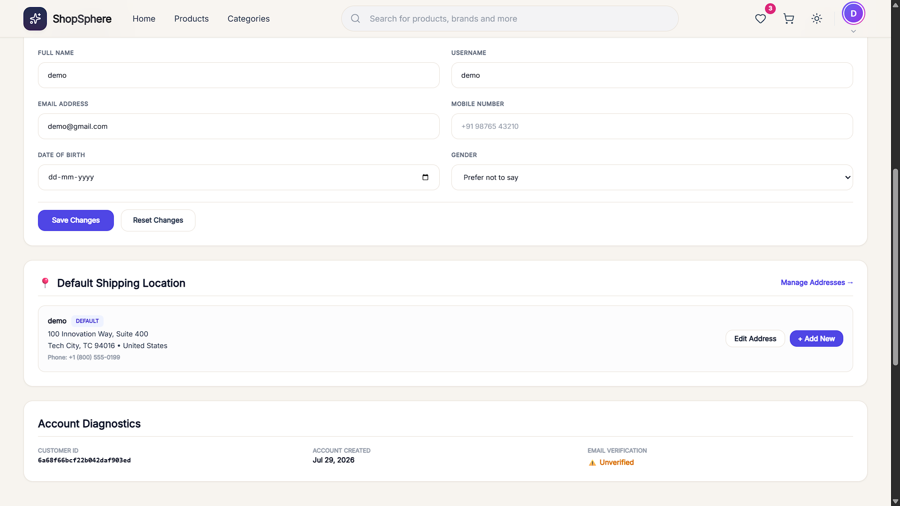

---

## 🌙 Dark Mode

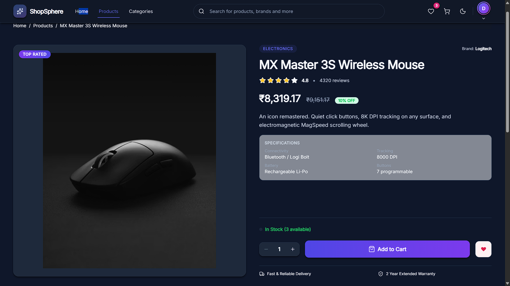

---

# 📁 Project Structure

```
ShopSphere
│
├── client
│   ├── src
│   ├── public
│   └── package.json
│
├── server
│   ├── config
│   ├── controllers
│   ├── middleware
│   ├── models
│   ├── routes
│   ├── utils
│   └── package.json
│
├── screenshots
├── README.md
└── LICENSE
```

---

# 🚀 Installation

## Clone Repository

```bash
git clone https://github.com/Tanish-8/ShopSphere.git
```

```
cd ShopSphere
```

---

## Install Frontend

```bash
cd client
npm install
```

---

## Install Backend

```bash
cd ../server
npm install
```

---

## Environment Variables

### Backend (.env)

```env
PORT=5001

MONGO_URI=YOUR_MONGODB_URI

JWT_SECRET=YOUR_SECRET

JWT_EXPIRE=30d

CLOUDINARY_CLOUD_NAME=

CLOUDINARY_API_KEY=

CLOUDINARY_API_SECRET=

RAZORPAY_KEY_ID=

RAZORPAY_KEY_SECRET=

CLIENT_URL=http://localhost:5173
```

---

### Frontend (.env)

```env
VITE_API_URL=http://localhost:5001/api

VITE_RAZORPAY_KEY=YOUR_KEY
```

---

## Start Backend

```bash
npm run dev
```

---

## Start Frontend

```bash
npm run dev
```

---

# 🔒 Security

- JWT Authentication
- Password Hashing
- Helmet
- Rate Limiting
- XSS Protection
- MongoDB Query Sanitization
- HPP Protection
- Secure CORS Configuration

---

# 📱 Responsive Design

The application is optimized for

- Desktop
- Laptop
- Tablet
- Mobile Devices

---

# 🎯 Future Improvements

- Email Verification
- Product Reviews
- Recommendation System
- AI Product Search
- Order Tracking
- Multi-vendor Support
- Inventory Dashboard
- Analytics Dashboard
- PWA Support

---

# 🤝 Contributing

Contributions are welcome.

1. Fork the repository
2. Create a feature branch
3. Commit your changes
4. Push your branch
5. Open a Pull Request

---

# 📄 License

This project is licensed under the MIT License.

---

# 👨‍💻 Developer

**Tanish Madishetty**

GitHub: https://github.com/Tanish-8

LinkedIn: https://www.linkedin.com/in/tanish-madishetty-020083221

Email: madishettytanish@gmail.com

---

<div align="center">

### ⭐ If you like this project, consider giving it a star!

</div>
